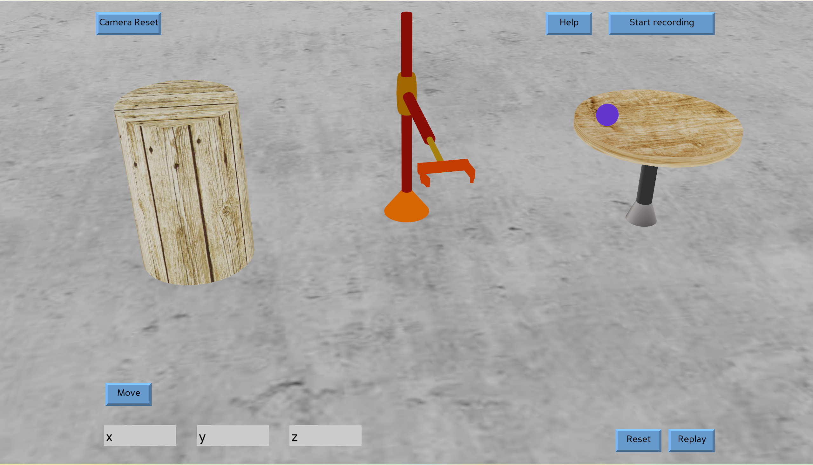

# Cylindrical Robot Model

This project presents a 3D model of a cylindrical robot created using Blender and subsequently integrated into a Python program with the assistance of Panda3D. The program facilitates control over the robot's arm, manipulation using a gripper, object transportation, dropping objects, recording robot movements, and playing them back. Additionally, it enables controlling the robot by inputting x, y, z coordinates for autonomous movement.

## Introduction

The Cylindrical Robot Model project showcases a detailed 3D rendering of a cylindrical robot, meticulously crafted within Blender's environment. This model is seamlessly incorporated into a Python application powered by Panda3D, enabling a dynamic simulation environment for interactive control and manipulation of the robot.

## Features

- Control the robotic arm for various tasks.
- Utilize a gripper mechanism for object manipulation.
- Move, drop, and transport objects within the simulation.
- Record and replay robot movements.
- Input coordinates for autonomous robot navigation.

## Usage

1. Run the Python program integrated with Panda3D.
2. Follow the intuitive interface to engage with the robot model.
3. Utilize the provided controls for arm manipulation, object handling, and movement recording.
4. Input desired coordinates for autonomous navigation.
